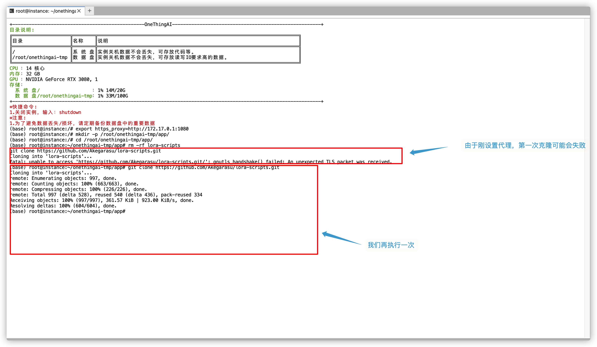

## 导语
> 不念过去，不畏将来，只争朝夕，不负韶华！

---

## 简介

什么是炼丹炉？

这其实是是AI绘画行业的黑话，是指用于训练AI模型的环境，通常需要强大的计算资源和专业知识，它类似于实验室，用于培育AI的创造力。
当然，发展到现在，我们不需要实验室那么大的环境，也能去训练一些我们需要的模型。

需要什么？
一张**合格的**显卡(RTX 3070+)

习惯使用大佬训练好的模型的你，现在来，让我带你炼出你的第一炉丹。

俗话说，工欲善其事，必先利其器。要想炼得一炉好丹。一个好的炼丹炉，也是必须要有的。我们可以使用别人打造好的炼丹炉，也可以自己打造一个。

## 丹炉锻造
### 环境

要想有一个好的炼丹炉，锻造室的选择也会有一定的影响，下面就我为这次打造的赛博丹炉选择的锻造室以及锻材，大家可以参考一下：

+ 锻造室(使用平台) [OnethingAI](https://onethingai.com/)
+ 锻材
  + (使用镜像) Miniconda/23.5.2/3.10(ubuntu22.04):11.8.0
  + (使用显卡) NVIDIA-GEFORCE-RTX-3080


  
### 炼制过程
**0.开机**

1.点击右侧工具栏 **JupyterLab** 按钮，进入 JupyterLab 页面。


2.进入命令行界面


3.打造赛博丹炉

接下来，克隆一下大佬整合好的代码。

但是！！！你会发现，你拉不下来代码！[/dog]

没错，聪明的你，以及发现你被墙了，这个时候，我们需要魔法。

跟着我，**设置代理**，执行以下命令:
```bash
export https_proxy=http://172.17.0.1:1080
```


然后我们继续克隆代码。
我们将我们克隆的代码放到这个目录(/root/onethingai-tmp/app/)下，方便以后查找：

**创建文件夹**
```bash
mkdir -p /root/onethingai-tmp/app/ 
```


**切换文件夹**
```bash
cd /root/onethingai-tmp/app/
```


**克隆秋叶大神整合包(lora-script)代码**
```bash
rm -rf lora-scripts
git clone https://github.com/Akegarasu/lora-scripts.git
```


克隆完成，**切换目录到lora-scripts**
```bash
cd lora-scripts
```


**克隆SD训练脚本(sd-script)代码**
```bash
rm -rf sd-script
git clone https://github.com/kohya-ss/sd-scripts.git
```


**克隆前端界面(frontend)代码**
```bash
rm -rf frontend
git clone  https://github.com/hanamizuki-ai/lora-gui-dist.git
mv lora-gui-dist frontend
```


到了这一步，我们以及完成了一大半了，接下来，我们首先:

**授于脚本执行权限**
```bash
chmod +x *
```


关闭魔法代理，这个时候使用代理，会降低我们初始化环境的速度。

**取消代理**
```bash
unset https_proxy
```


**执行脚本初始化环境**
```bash
./install.bash
```


**重新开启魔法**
```bash
export https_proxy=http://172.17.0.1:1080
```

**启动服务**
```bash
source venv/bin/activate
./run_gui.sh --port 7860
```


**设置本地代理**:需要打开本地命令行窗口(windows 打开cmd 或者 powershell 都可以)


**打开本地界面**


**完工**
通过以上操作，我们就已经把我们的炼丹炉锻造好了。

[/good] [/nice] [/perfect]

4.命令整合版

```bash
#!/usr/bin/bash

mkdir -p /root/onethingai-tmp/app/
cd /root/onethingai-tmp/app/

echo "enabled proxy"
export https_proxy=http://172.17.0.1:1080

rm -rf lora-scripts
echo "clone lora-script"
git clone https://github.com/Akegarasu/lora-scripts.git

cd lora-scripts

echo "clone sd-script"
rm -rf sd-script
git clone https://github.com/kohya-ss/sd-scripts.git

echo "clone frontend"
rm -rf frontend
git clone  https://github.com/hanamizuki-ai/lora-gui-dist.git
mv lora-gui-dist frontend

unset https_proxy

echo "init environment"
chmod +x *
./install.bash

echo "activate environment"
source venv/bin/activate

echo "enabled proxy"
export https_proxy=http://172.17.0.1:1080

echo "start web server"
./run_gui.sh --port 7860
```
