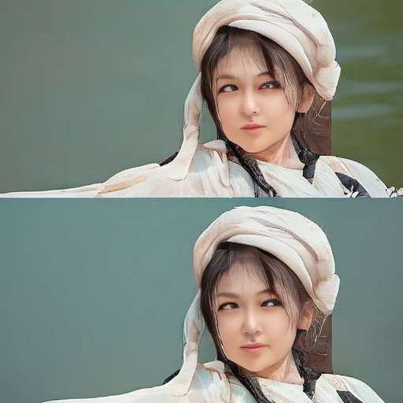
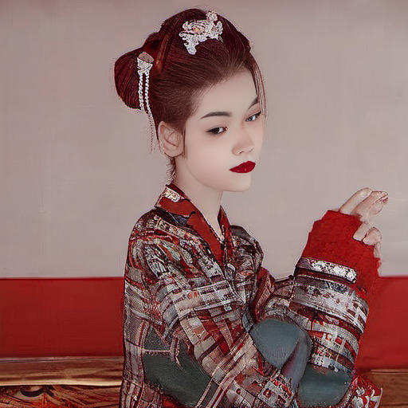
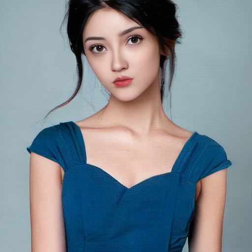
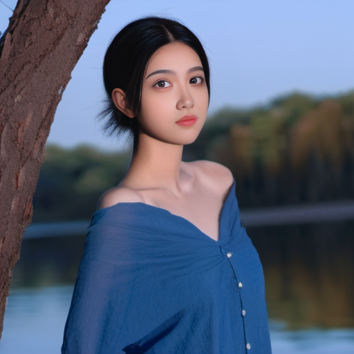
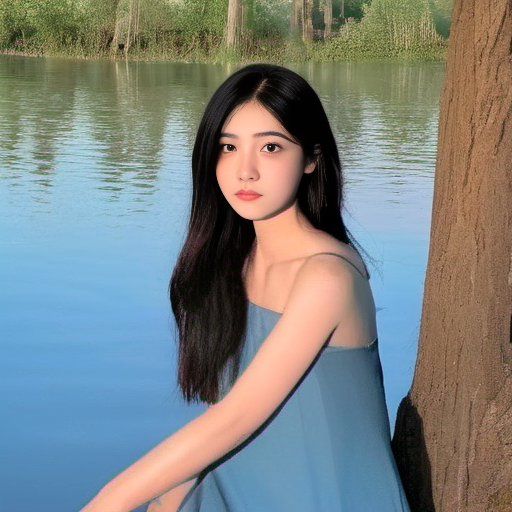

# 《魔法师的修炼之路》

## 第一章 初识咒语 

---
## 导语
> 不念过去，不畏将来，只争朝夕，不负韶华！

---

+ 时间：SD历2年
+ 地点：AI绘画世界-SZ市-基础魔法学院-贝斯学院

___

这是我穿越AI绘画世界的第7天，在我快要因为没有穿越者的金手指要被饿是在深山老林时，一位从天而降的美女将我救了出来。
她发现了我的魔法天赋，于是带我去到了SZ的魔法学院，让我学习魔法。
我也不知道为什么她要这么帮我，如果一定要一个答案，那就只能是我长得帅，或者，这就是我的金手指---《天选之人》

不能胡思乱想了，老师来了，这节课，老师会带领我们学习基础魔法构建《文生图》

___

### 文生图

顾名思义，文生图，就是通过吟唱咒语来施展魔法。
+ 文：指代咒语，即提示词。
+ 图：指代魔法，即生成的图片

在基础学习里，我们已经知道了为什么要吟唱咒语才能施展魔法，现在，为了防止同学们遗忘，我们再来回顾一下。
>AI绘画世界里，遵循这样的规则，具备法力的人，在吟唱咒语时，AI绘画世界会根据咒语形成魔法。(AI模型会根据提示词，画出对应的图片)

需要注意：
你的咒语**越是宽泛**，施展出的魔法就**越不可控**。
如我们施展以下魔法：

+ 施展环境(大模型)：国风汉服写实SDXL
+ 咒语(提示词): 1 girl,
+ 施法次数(总批次数*单批数量): 2

施法结果：




我们可以看出，每次施法的结果都不相同，并且不一定符合最基础的咒语。所以，我们需要更加全面的咒语，来帮助我们更好的完成魔法。

接下来，我们来完善魔法。

首先，加入人物形象咒语：

咒语
```text
photograph of a beautiful girl,(in a blue dress),looking at viewer, (upper body ||full body:1.2),
black hair, (perfect eyes, beautiful face and black eyes:1.3, natural skin),
```


> photograph of a beautiful girl,(in a blue dress),looking at viewer,(upper body ||full body:1.2),black hair,(perfect eyes, beautiful face and black eyes:1.3, natural skin),
Steps: 20, Sampler: DPM++ 2M Karras, CFG scale: 7, Seed: 1554220527, Face restoration: GFPGAN, Size: 512x512, Model hash: 9ec203c3a6, Model: 国风_汉服_写实_SDXL, Version: v1.6.0


> photograph of a beautiful girl,(in a blue dress),looking at viewer,(upper body ||full body:1.2),black hair,(perfect eyes, beautiful face and black eyes:1.3, natural skin),
Steps: 20, Sampler: DPM++ 2M Karras, CFG scale: 7, Seed: 1554220528, Face restoration: GFPGAN, Size: 512x512, Model hash: 9ec203c3a6, Model: 国风_汉服_写实_SDXL, Version: v1.6.0
 


从上面，我们已经可以看出来，魔法中的人物形象已经开始丰满了起来，我们可以尝试继续完善它，现在，我们加入一下环境咒语。

```text
photograph of a beautiful girl,(in a blue dress),looking at viewer, (upper body ||full body:1.2),
black hair, (perfect eyes, beautiful face and black eyes:1.3, natural skin),
cotton material,candle light,by a lake with a tree,
```

> photograph of a beautiful girl,(in a blue dress),looking at viewer, (upper body ||full body:1.2),
black hair, (perfect eyes, beautiful face and black eyes:1.3, natural skin),
cotton material,candle light,by a lake with a tree,
Steps: 25, Sampler: DPM++ 2M Karras, CFG scale: 7, Seed: 1554220530, Face restoration: GFPGAN, Size: 512x512, Model hash: 9ec203c3a6, Model: 国风_汉服_写实_SDXL, Version: v1.6.0



> photograph of a beautiful girl,(in a blue dress),looking at viewer, (upper body ||full body:1.2),
black hair, (perfect eyes, beautiful face and black eyes:1.3, natural skin),
cotton material,candle light,by a lake with a tree,
Steps: 25, Sampler: DPM++ 2M Karras, CFG scale: 7, Seed: 1554220529, Face restoration: GFPGAN, Size: 512x512, Model hash: 9ec203c3a6, Model: 国风_汉服_写实_SDXL, Version: v1.6.0


接下来，我们再来提升一下魔法的质量，让魔法具有更多的内涵，让魔法具现出更多的细节:

```text
photograph of a beautiful girl,(in a blue dress),looking at viewer, (upper body ||full body:1.2),
black hair, (perfect eyes, beautiful face and black eyes:1.3, natural skin),
cotton material,candle light,by a lake with a tree,
(details:1.1), photorealistic, ultra realistic,32k,RAW photo, 8k uhd, dslr, high quality, film grain, QIEMANCN
```


