## 序言
> 不念过去，不畏将来，只争朝夕，不负韶华！

## 模型管理---进阶

最近发现，同学们的实例一不小心就开不机了，其原因，大多数是实例的系统盘被占用满了，导致无法开机。
最终只能求助GM帮我们清理部分镜像，然后才能再次使用。
究其原因，其实是因为同学们把模型都下载到了系统盘了，接下来，就来教大家如何管理自己的模型。

**环境**

+ 使用平台 [OnethingAI](https://onethingai.com/)
+ 使用镜像 Ubuntu(22.04)/药师AIGCstable-diffusion-webui:v4.2
+ 使用显卡 NVIDIA-GEFORCE-RTX-3080

### Step 1: 创建实例

之前已经教过大家创建实例和初步使用，这里就不在重复了。

### Step 2: 查看磁盘信息

在OnethingAI平台，我们的实例拥有两块盘，一块是**系统盘**(类似于windows的C盘)，一块是数据盘。
如何查看呢？

1. 在开机状态下点击右侧工具栏 JupyterLab 按钮
2. 点击 + 号按钮 进入新的 Tab 页。
3. 点击 Terminal 按钮 进入命令行终端。
4. 查看红框部分磁盘信息。

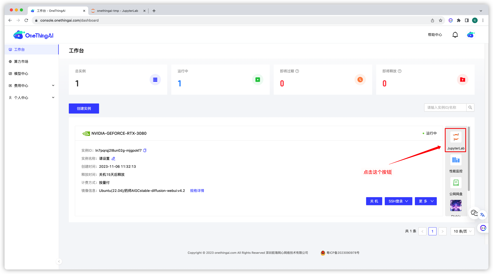
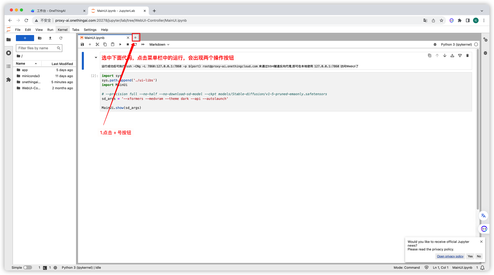
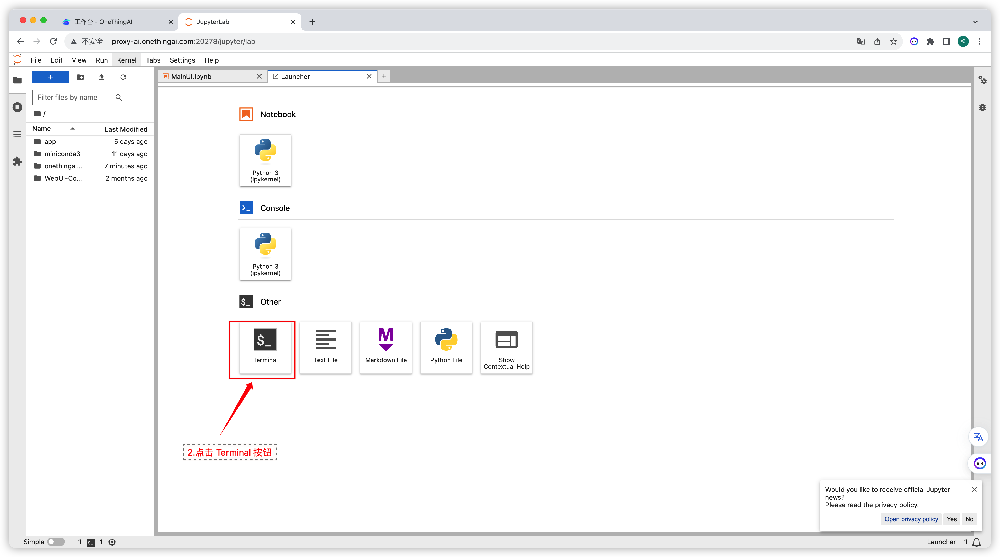
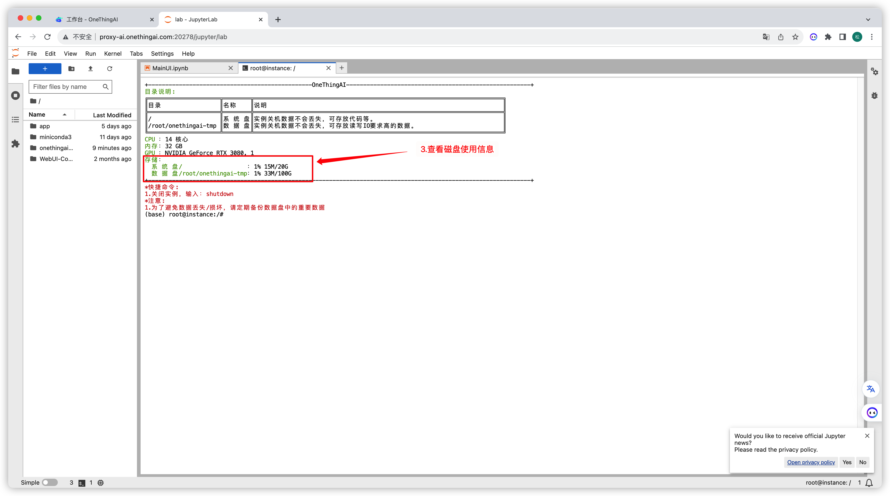


### Step 3: 创建文件夹

在上一个步骤中，我们已经知道，我们的数据盘为 **/root/onethingai-tmp** 这个文件夹。
接下来，我们需要在这个文件夹下面准备两个文件夹来存放我们的大模型(checkpoint)和Lora模型.

1. **点击**文件夹图标
2. **双击** onethingai-tmp 文件夹进入 onethingai-tmp 文件夹
3. 点击创建文件夹图标创建文件夹 models
4. 点击创建文件夹图标创建文件夹 loras

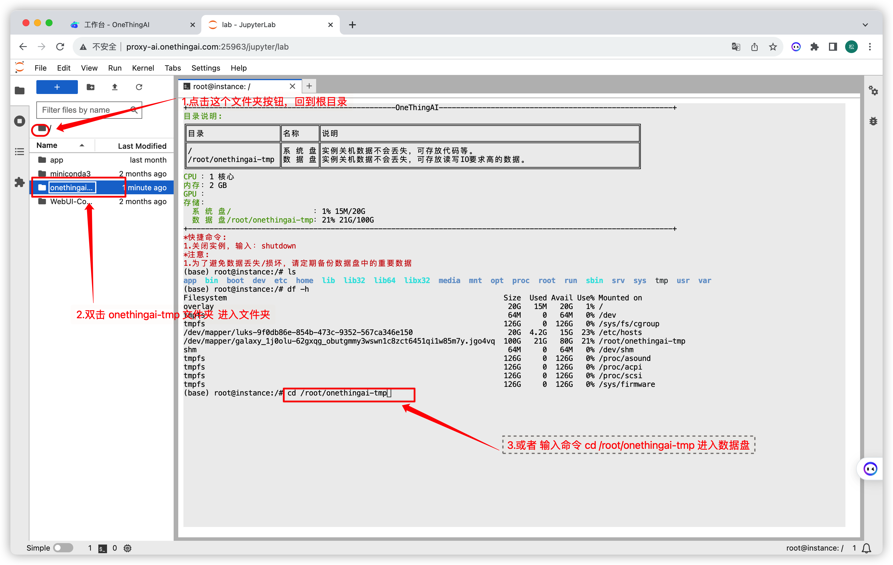
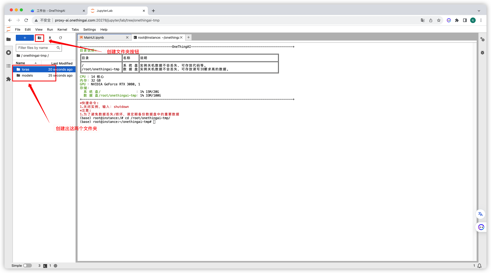

### Step 4: 上传模型

我们已经创建好了两个文件夹来存放我们的模型：
+ models:存放大模型(checkpoint)
+ loras: 存放Lora模型

我们首先进入 models 文件夹，接下来：

**方式一** 

+ 点击上传按钮上传本地模型。
+ 或者拖拽文件到目录。

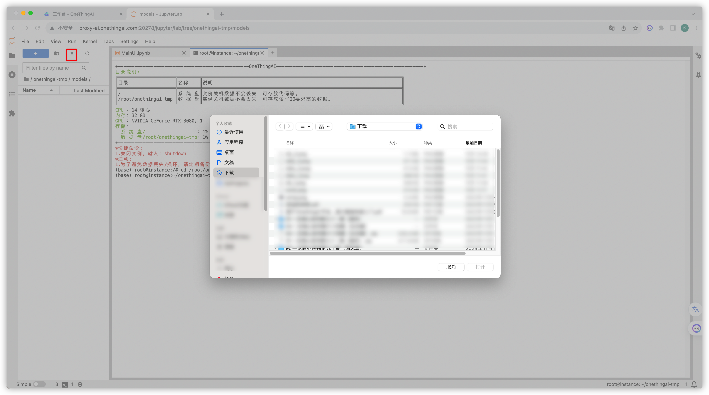
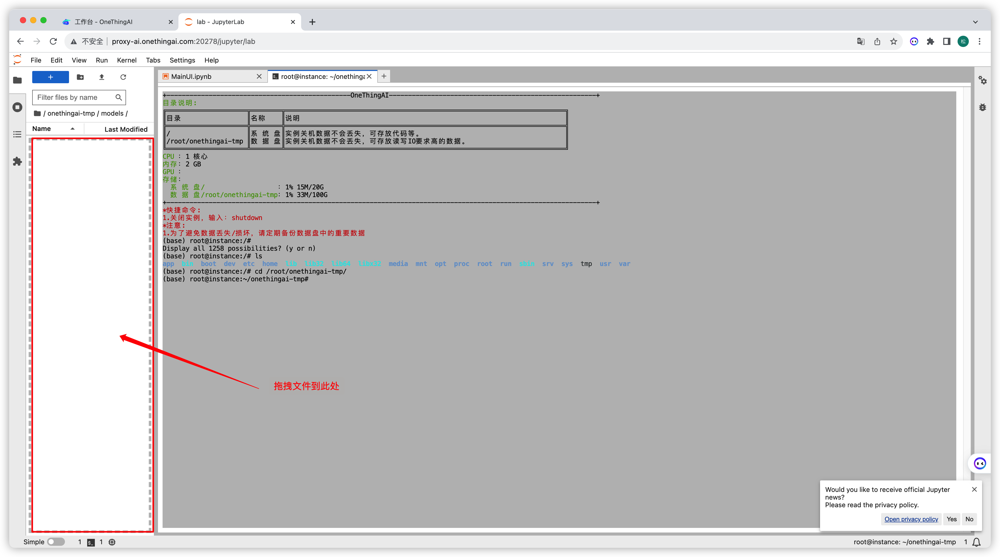

**方式二**

从模型站下载模型

国内的模型站给大家推荐 [liblib](https://www.liblib.ai/) 。

1. 打开 [liblib](https://www.liblib.ai/)  首页


2. 筛选我们需要的模型:checkpoint 就是大模型。
   
3. 这里我们下载 guofeng3这个模型
   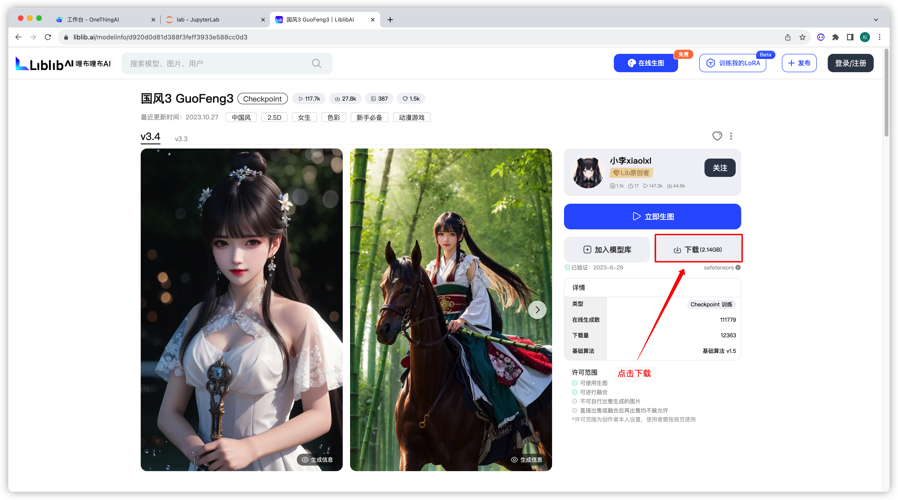
4. 打开下载界面，右键，复制下载链接
   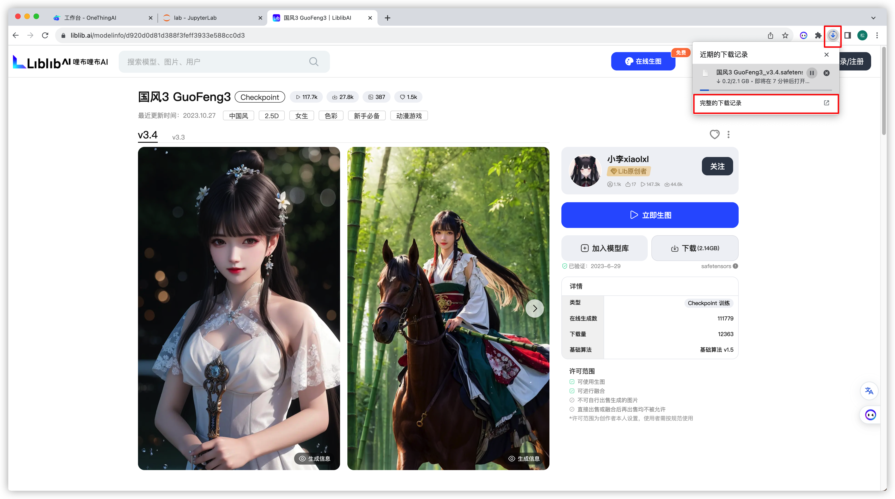
   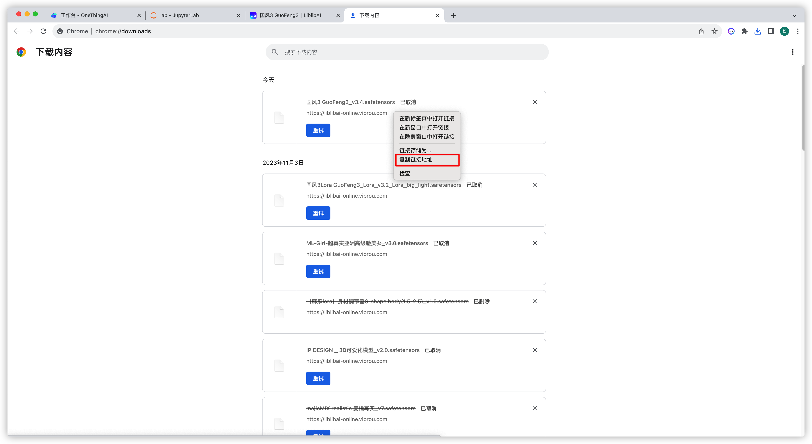
5. 打开我们刚刚创建的model文件夹
```bash
cd /root/onethingai-tmp/models
```
6. 执行以下命令，下载模型
```bash
wget 这里粘贴你刚才复制的下载链接，然后回车
# 类似这样 
# wget https://liblibai-online.vibrou.com/web/model/a83e25fe5b70bad595fe4dd6733ee35f0e3ddf8ed4041ab360f9573556e8b3e6.safetensors?attname=%E5%9B%BD%E9%A3%8E3%20GuoFeng3_v3.4.safetensors
```
   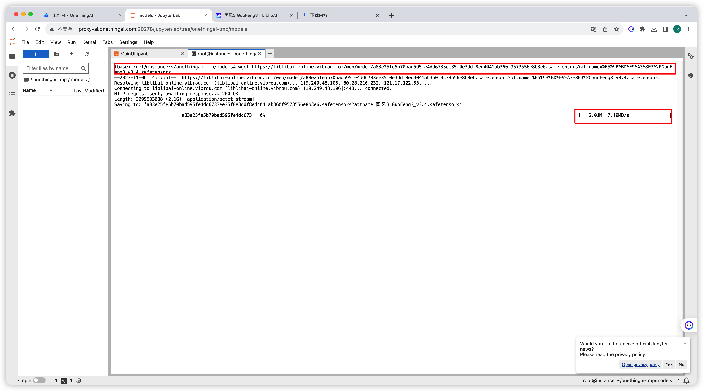
7. 等待下载完成
8. 下载完成后，在左侧的目录中就能查看到下载好的模型，我们会发现，模型名称太长，我们给他改个名称。
   1. 右键对应文件，选择rename
   2. 修改名称为guofeng3 (注意保留后缀)

    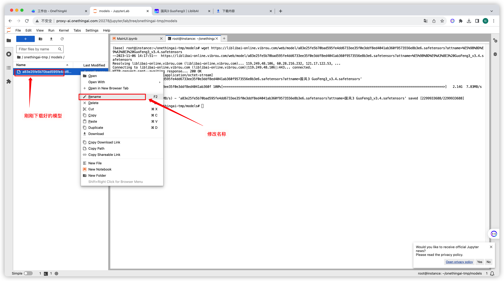
    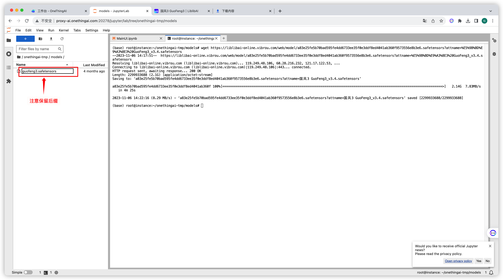
9. 再次查看磁盘信息，我们会发现，我们占用的是数据盘空间。
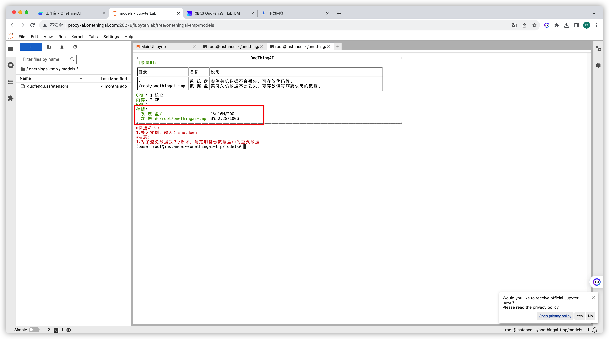

### Step 5: 创建软连接

我们在上面步骤中，虽然已经将模型文件下载下来了，但是我们的模型并不在 SD的 models 文件夹下，如果我们要使用这个模型，我们不可能使用时再将模型复制过去，这样过于麻烦。
我们通过软连接，将我们的模型和 SD 的 models 关联起来。

1. 首先，我们切换到 SD 的 大模型文件夹下 

```bash
cd /app/stable-diffusion-webui/models/Stable-diffusion
```

2. 创建软连接：我们将刚刚创建的models文件夹关联过来。
```bash
ln -s /root/onethingai-tmp/models model 
```
通过上述操作，你会发现，在当前文件夹下已经创建了一个model文件夹，二这个文件夹，是指向我们刚才在数据盘创建的models文件夹的。

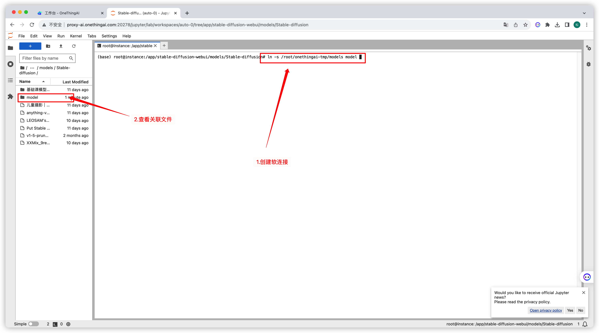

### Step 6: 检查模型是否加载成功

通过以上步骤，我们在数据盘下载好了模型，并且与SD关联了起来，接下来，我们进入SD WEBUI 检查模型能否正确加载。

1. 查看模型

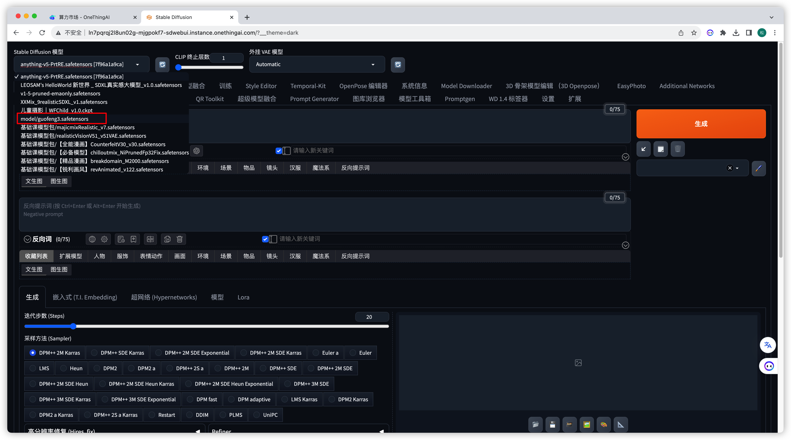

2. 使用这个模型生成一张图片

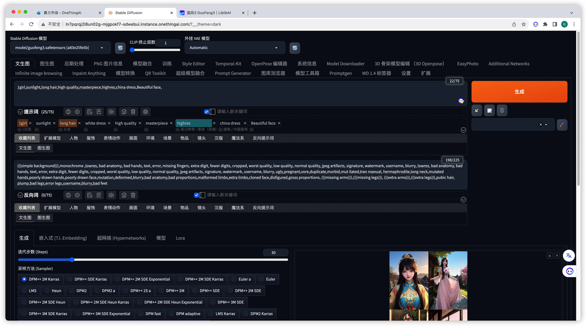


咒语：
提示词：
> 1girl,sunlight,long hair,high quality,masterpiece,highres,china dress,Beautiful face,

反向提示词：
> (((simple background))),monochrome ,lowres, bad anatomy, bad hands, text, error, missing fingers, extra digit, fewer digits, cropped, worst quality, low quality, normal quality, jpeg artifacts, signature, watermark, username, blurry, lowres, bad anatomy, bad hands, text, error, extra digit, fewer digits, cropped, worst quality, low quality, normal quality, jpeg artifacts, signature, watermark, username, blurry, ugly,pregnant,vore,duplicate,morbid,mut ilated,tran nsexual, hermaphrodite,long neck,mutated hands,poorly drawn hands,poorly drawn face,mutation,deformed,blurry,bad anatomy,bad proportions,malformed limbs,extra limbs,cloned face,disfigured,gross proportions, (((missing arms))),(((missing legs))), (((extra arms))),(((extra legs))),pubic hair, plump,bad legs,error legs,username,blurry,bad feet

其他参数：
> Steps: 30, Sampler: DPM++ 2M Karras, CFG scale: 7, Seed: 1115658207, Size: 512x768, Model hash: a83e25fe5b, Model: guofeng3, Version: v1.6.0