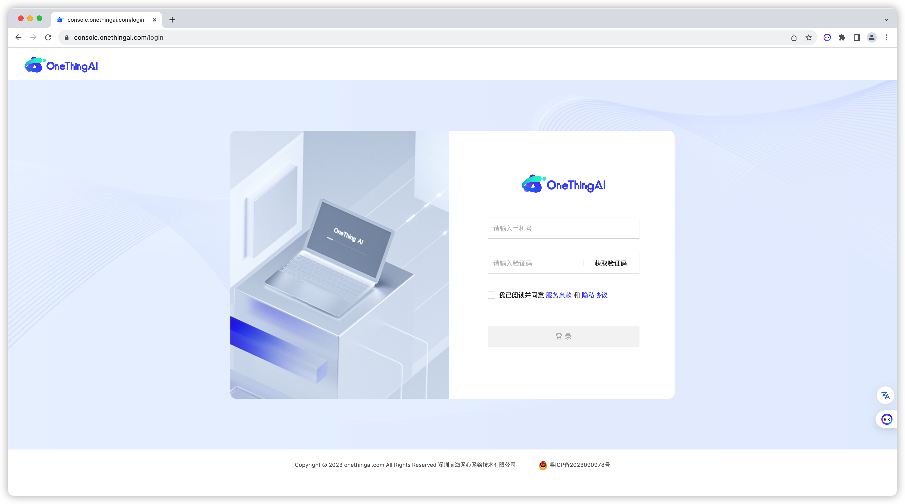
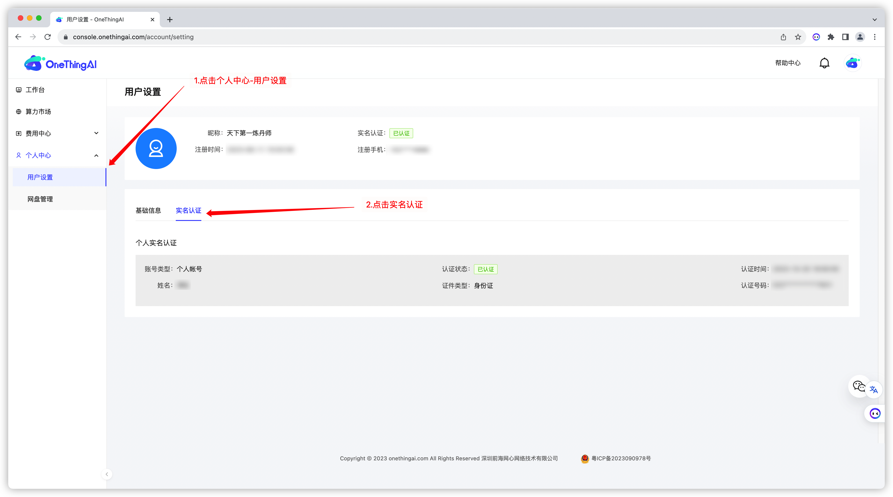
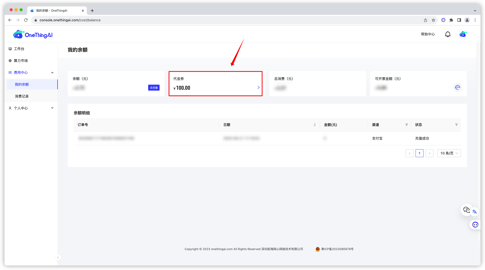
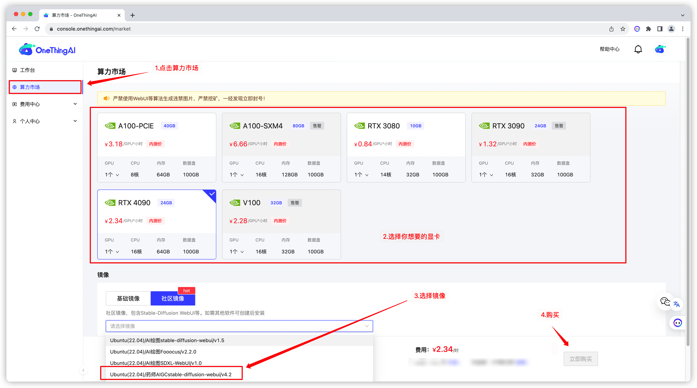
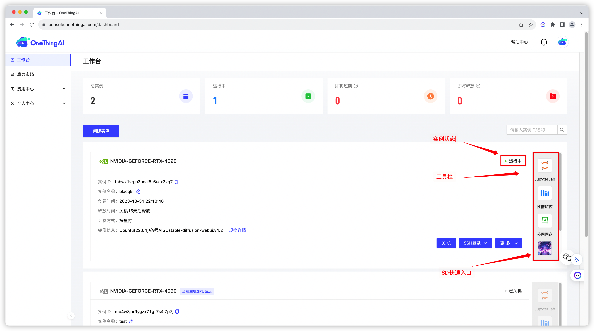
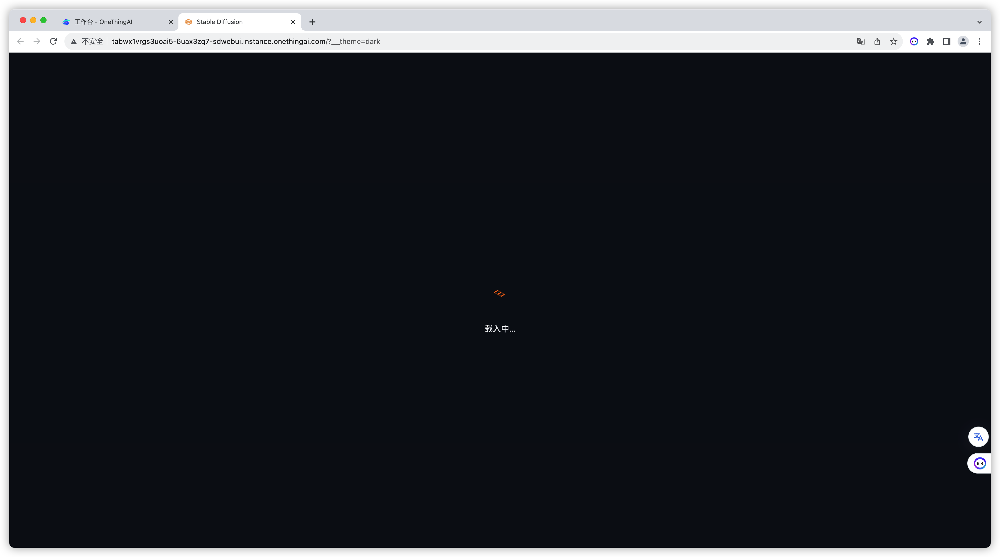
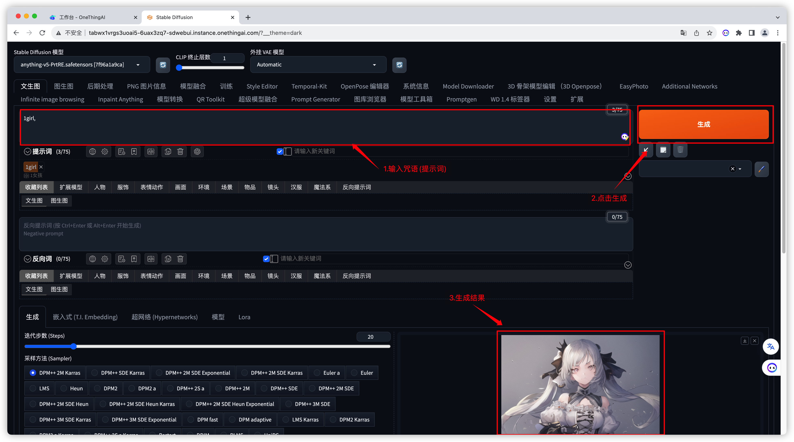

## 序言
> 不念过去，不畏将来，只争朝夕，不负韶华！

## 概述

### 缘由
最近在做一些AI相关的东西，于是去了解了一些AIGC相关的东西。遇到一些问题，就是AIGC领域虽然在蓬勃发展，但是很多人想去体验，却是有一定的门槛；ChatGPT需要会魔法上网，而AI生成式绘画则得益于SD的开源，让我们只需要有消费级显卡(GPU)就能体验，但很多不完游戏的同学，并不具备这样的条件，为了体验AI绘画，就去置办，成本也过于高昂。于是我就想，有没有让我能够低成本体验到他们的方法，经过一段时间的折腾，算是有了一定成果，于是写出来分享给大家。

### 作用
本文旨在帮助没有绘画经验的人迅速上手，借助AI技术创建令人印象深刻的艺术作品。通过这个快速入门，你将了解如何在[OnethingAI](https://onethingai.com/)平台上使用AI绘画工具，无需任何绘画背景知识，即可轻松创作出独特的艺术作品。这个入门指南将介绍AI绘画的基本原理，提供使用平台的步骤指导，以及一些实用的技巧，使你能够迅速开始在AI辅助下探索绘画的乐趣。无论你是绘画新手还是有经验的艺术家，这个指南都将为你提供一个简单而有趣的AI绘画入门体验。

### 使用对象

+ 想低成本体验AI绘画的群体

### 平台推荐

+ [OnethingAI](https://onethingai.com/)
+ [吐司](https://tusiart.com)

## 平台使用

相较于自己购买显卡然后去搭建AI绘画需要的环境，选择云平台对于小白用户而言，或许会是一个更好的方法。
它的成本更加低廉，无需搭建环境，大多数情况下开箱即用，云平台厂商或多或少会有一定的服务保障，不懂的问题可以直接提问。

下面，我将介绍一下我现在使用的云平台[OnethingAI](https://onethingai.com/)，至于为啥选择它，主要是便宜，完成实名认证就送**50块代金券**，不用充钱就能让我使用。对于我这种羊毛党来说，那是巨大的福音。

**传送门**

+ OneThingAI官网：https://onethingai.com
+ OneThingAI控制台：https://console.onethingai.com

Step 1: 平台注册

1. 打开 [OneThingAI官网](https://onethingai.com) 
2. 点击右上角控制台按钮
3. 输入手机号自动注册登录

Step 2: 实名认证

> 为啥要实名？
> 1. 有钱(我肯定不是因为可以白嫖，我不是，不可能 Orz)。
> 2. 平台规定。
> 3. 国家规定。

1. 点击个人中心-用户设置
2. 找到Tab页里的实名认证
3. 点击费用中心-我的余额
4. 查看代金券，如果你已经认证，你会收到50元的代金券(发放可能有延迟，官方说最多2分钟就到账)。
5. 你可以点击代金券，查看过期时间
6. **注意**：代金券不需要主动使用，被动生效，使用时实例产生费用优先抵扣。

Step 3. 创建实例

到了这一步，我们就可以开始白嫖了，首先我们需要在算力市场，创建一个实例。

1. 点击算力市场
2. 选择显卡：不知道选哪张就有啥选啥(显卡好坏影响的只是出图速度)，或者往贵的选(反正当前是白嫖的)。
3. 选择社区镜像：药师AIGC 这个，它里面已经集成好了很多的lora和模型，可以使我们生成的图片更加好看。
4. 点击创建

Step 4: 我的第一张图片

创建实例完成后，页面会自动跳转到工作台界面，在这里，我们需要关注的有下面几个地方：

1. 实例状态：表示实例当前的运行状态，实例创建时，在部署成功后会**主动开机一次**，小伙伴们要注意，不用创建完了就不管了，因为当实例处于运行状态时，是会计费的。
2. 右侧工具栏： 当实例处于运行状态时，右侧工具栏时可以点击的，它是一些快速入口，让我们更方便的使用实例。
3. SD快速入口，右侧工具栏中有一个花里胡哨的按钮，那个便是SD WEB UI 的快速入口。现在让我们点击它，开始我们的第一张AI绘画之旅。

4. 点击按钮后，我们会进入SD WEB UI界面，SD第一次启动时，会需要等待一段时间加载，由于药师的资源较多，可能需要等待一段时间。
5. 如果等待时间过长，可以选择刷新页面，或许有惊喜。

6. 进入到WEBUI后，我们会发现，界面非常复杂，功能非常多，对于小白而言，我们暂时不需要管那么多，只需要关注我用红框勾选出来的部分即可。
7. 第一个是提示词输入框，在这里，我们可以输入一些提示词(英文），告诉AI你想要什么。
8. 第二个是生成按钮，输入完成提示后，我们便可以点击生成按钮生成图片。
9. 第三个是图片展示区域，点击生成按钮后，我们等待一小段时间，便可在图片展示区域得到生成好的图片。

10. 点击图片，我们便可以查看大图。(图片是AI生成的，如果不满意，可以多生成几次，或者调整提示词)

## 结语

至此，我们便完成了我们的第一次AI绘画之旅，非常感谢小伙伴们能耐心看完本文，相信会有一定的收获。

接下来，我会带小伙伴们入门AI绘画，让你了解更多AI绘画的知识。
