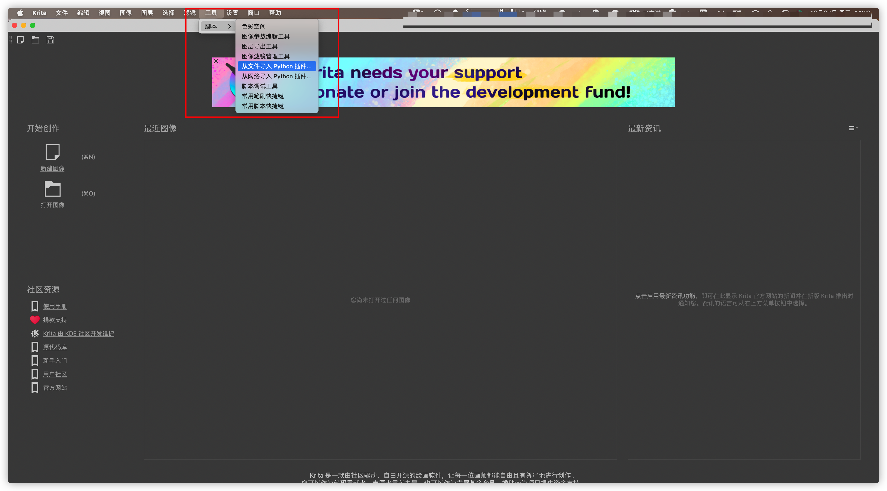
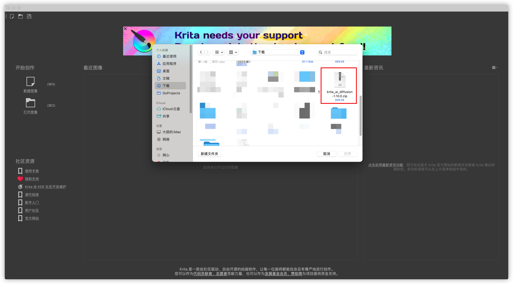
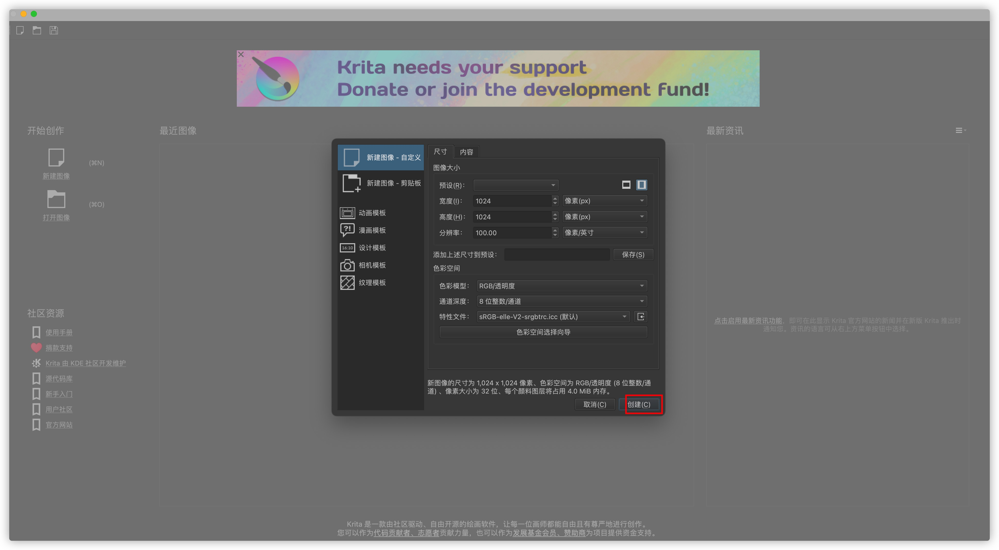
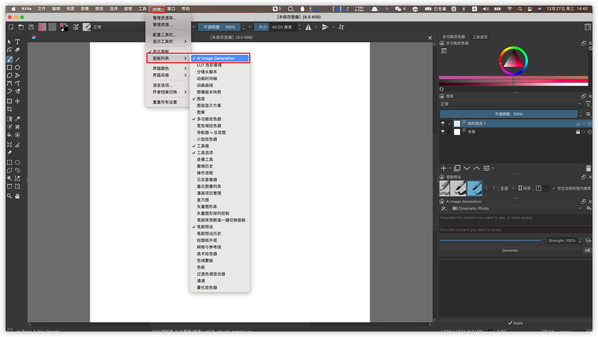
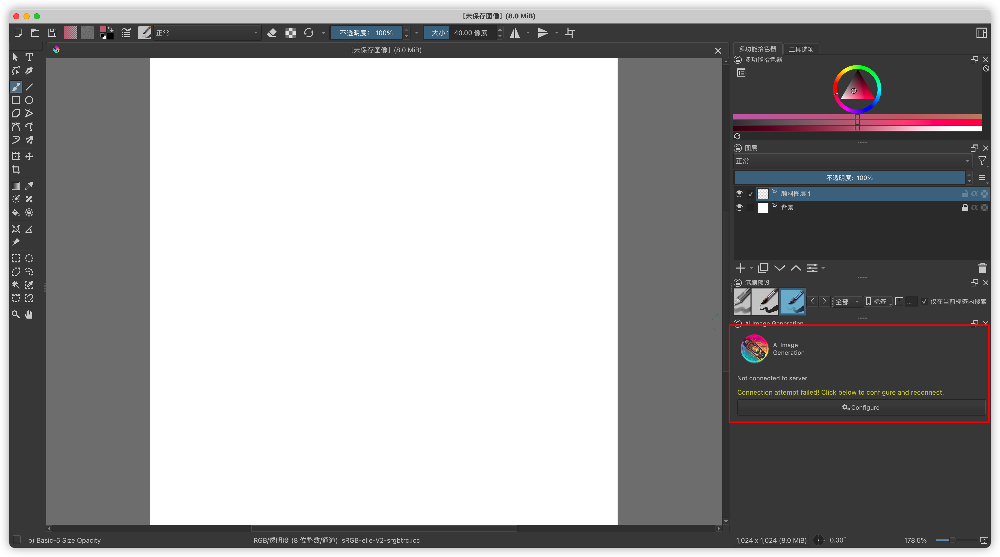
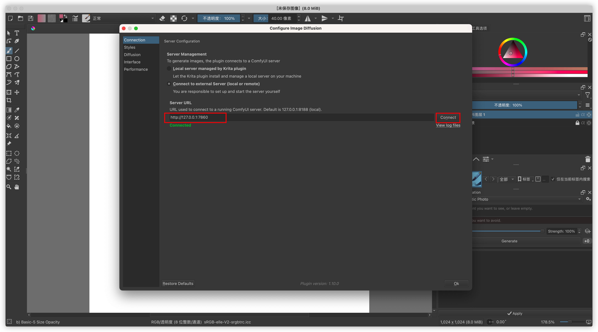

## 序言
> 不念过去，不畏将来，只争朝夕，不负韶华！

# 安装
首先我们需要在社区选择一个ConfigUI的镜像，版本需要大于 v0.0.4.
在我们的本地需要安装好 krita .

## krita 插件安装
在这里我们需要安装插件，用来支持 config-ui. 已经安装插件可以忽略。[链接地址](https://github.com/Acly/krita-ai-diffusion/releases/download/v1.10.0/krita_ai_diffusion-1.10.0.zip)

1.打开krita，点击菜单栏工具选项，选择脚本，从文件导入。

2.选择我们刚才下载的插件包。（压缩包，不用解压）

3.重启krita。

## 配置
1.点击右侧工具栏自定义服务按钮，根据[自定义服务指引](https://onethingai.com/docs/custome_tool/)将我们的服务代理出来。

2.打开krita，创建一副图像。

3.点击菜单栏，设置-->面板列表，勾选 AI Image Generation.

4.点击小面板 configure 按钮，弹出配置界面。选择远程服务，填入 http://127.0.0.1:7860,点击connect,显示绿色的connected变成功。

